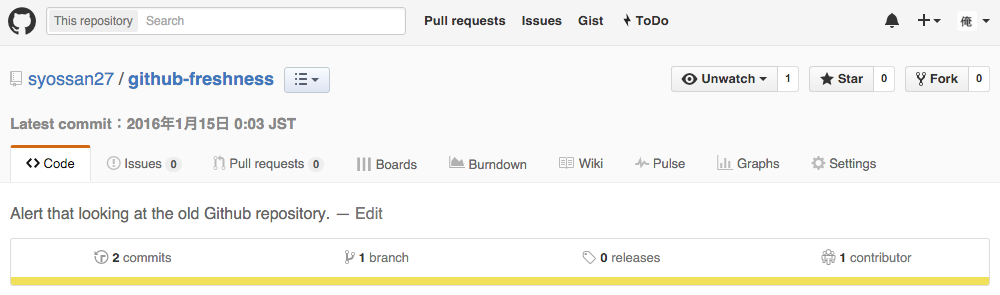
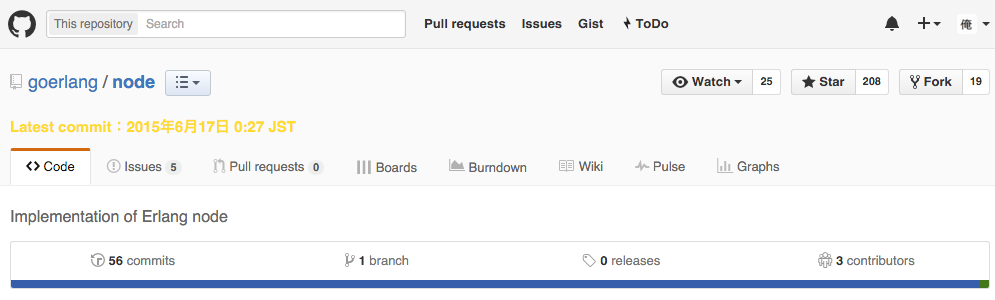
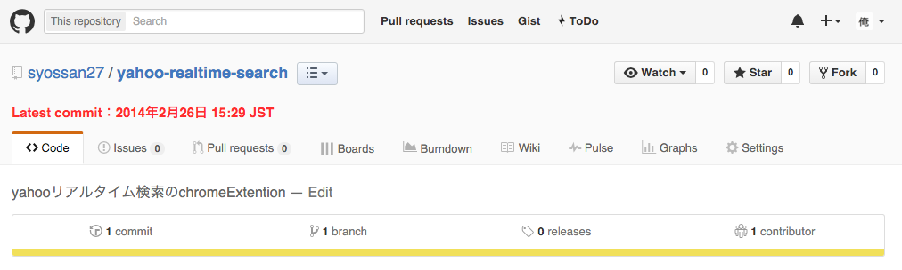
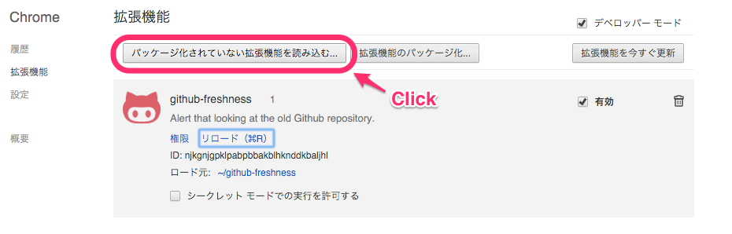
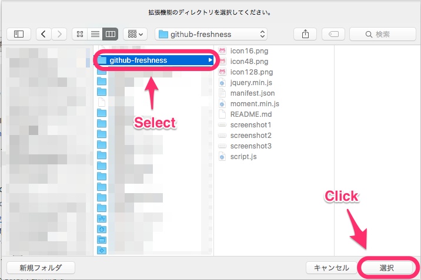

# github-freshness

Display lasted commit date.
If looking at the old Github repository, display alert.

## Description

- Display lasted commit date.


- lasted commit date is half a year ago.


- lasted commit date is a year ago.


## Usage

````
$ git clone git@github.com:syossan27/github-freshness.git
````




## Install

## License

[MIT](http://opensource.org/licenses/mit-license.php)

## Author

[syossan27](https://github.com/syossan27)
